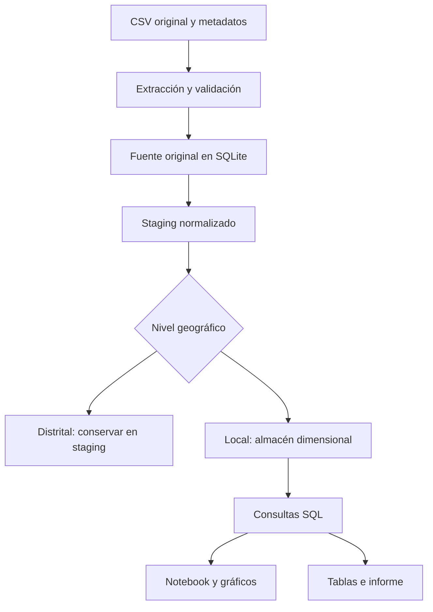
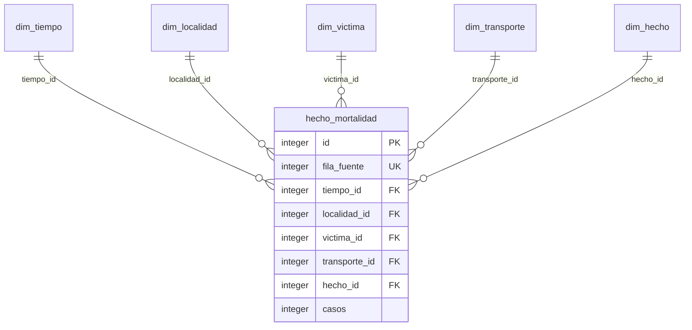

# Arquitectura y modelo de datos

## Modelo estrella

El grano de `hecho_mortalidad` es una fila de la fuente en nivel local, definida por las características publicadas; no se afirma que cada fila sea una persona. `casos` es una medida aditiva entre filas del detalle. `fila_fuente` corresponde al número de línea del CSV, incluyendo el encabezado: permite rastrear la carga, pero no identifica a una víctima.

| Tabla | Atributos |
|---|---|
| dim_tiempo | Año, mes, número del mes, día de semana, orden del día, franja y hora inicial |
| dim_localidad | Código, localidad e indicador de ubicación conocida |
| dim_victima | Sexo, ciclo vital, condición, país, pertenencia grupal, ancestro racial y pertenencia étnica |
| dim_transporte | Medio de transporte y objeto de colisión |
| dim_hecho | Tipo de accidente y circunstancia |
| hecho_mortalidad | Identificadores de dimensiones, fila original y número de casos |

Las dimensiones usan claves sustitutas enteras. Una dimensión puede relacionarse con muchas filas de hechos; cada hecho tiene una entrada en cada dimensión. El perfil de víctima es una combinación de atributos, no una persona identificada. La dimensión temporal no inventa una fecha: el CSV solo permite conocer año, mes, día de la semana y franja.

`fuente_original` conserva 12.386 filas con los 18 nombres y valores originales como texto. `stg_mortalidad` conserva todas las filas normalizadas y un campo que distingue niveles geográficos. Solo las 6.193 filas locales se cargan en el hecho. La vista `vw_mortalidad` reconstruye las variables originales limpias mediante JOIN y se usa para el EDA.

La carga usa una base temporal, verifica claves, integridad y totales, y luego reemplaza la base anterior. Repetirla no acumula registros. Si la réplica geográfica deja de coincidir, el proceso se detiene sin reemplazar la base. Esta regla está diseñada para esta fuente y debe reevaluarse en una actualización.

El repositorio es un almacén de código, no un lago de datos. El CSV representa la capa de origen; staging separa limpieza y auditoría; el esquema estrella implementa un almacén dimensional sencillo en SQLite.
