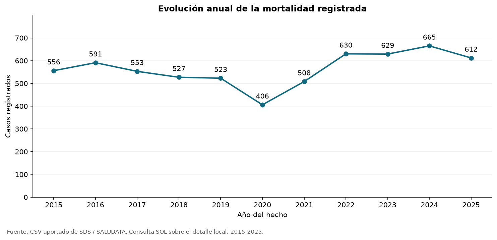
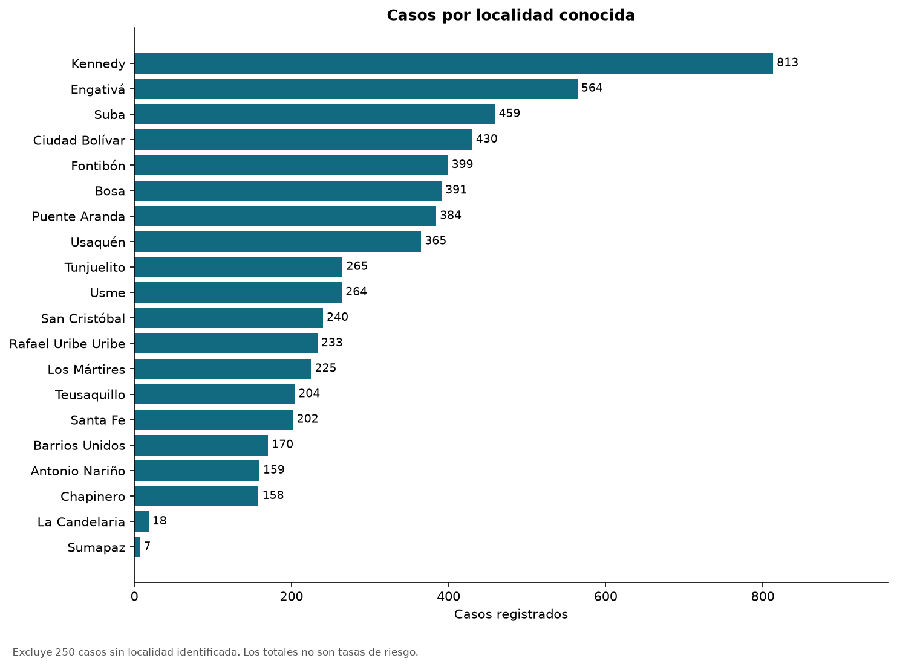
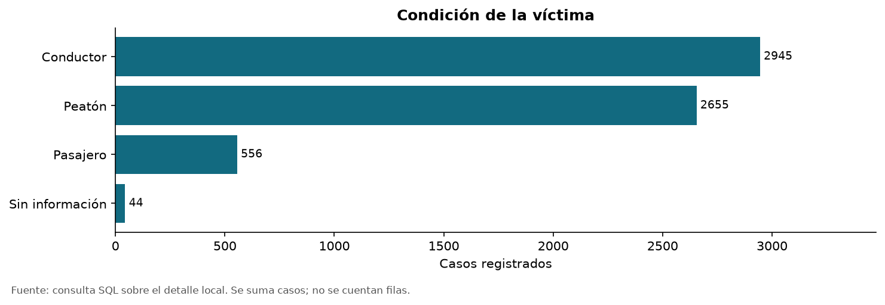
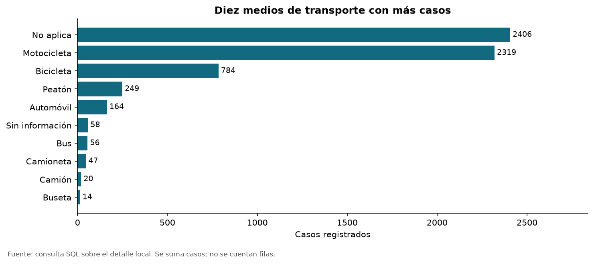
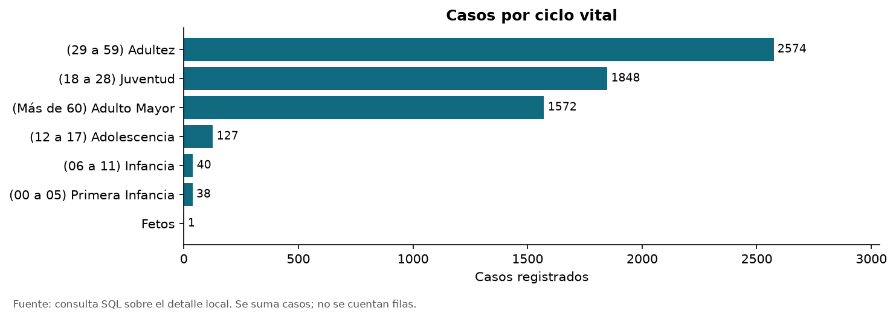
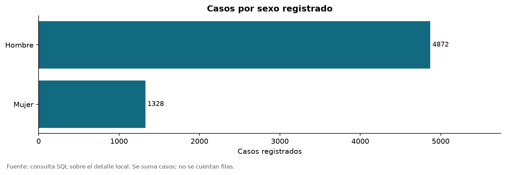
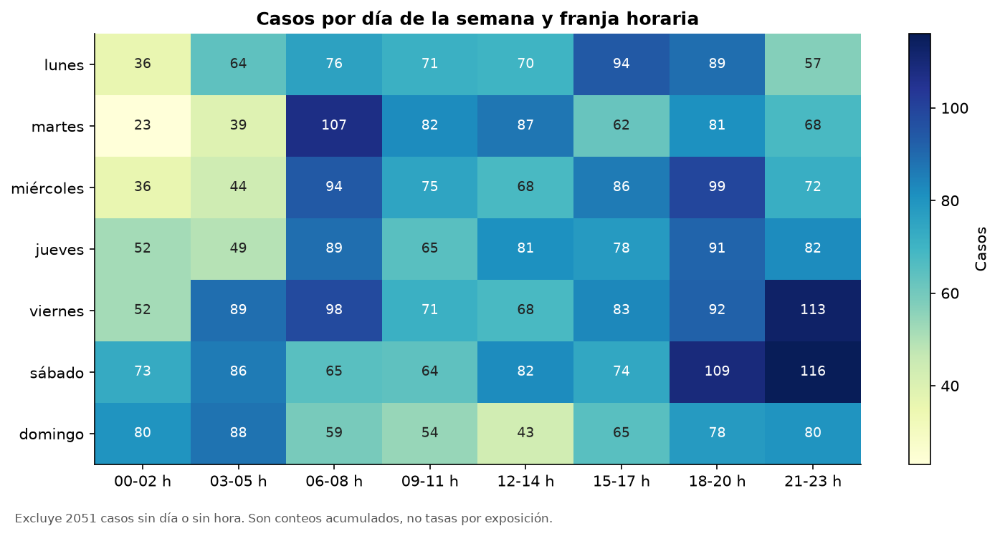
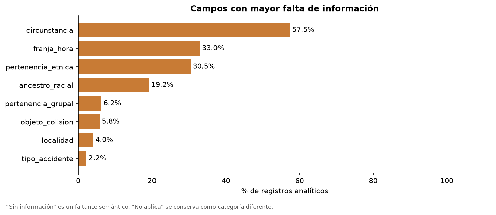
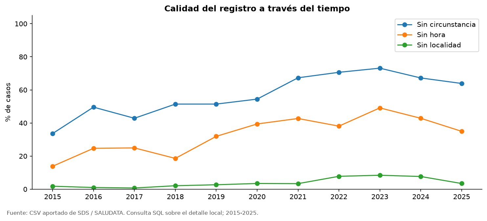
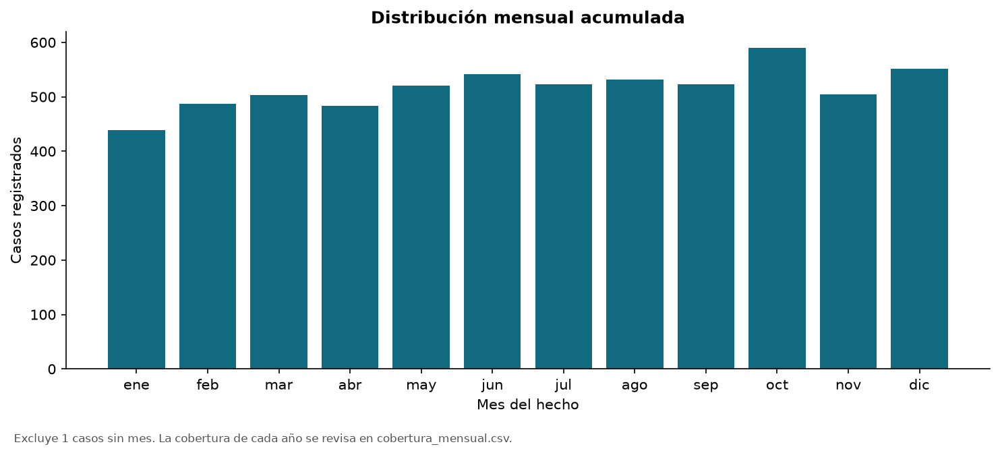

# Mortalidad por accidentes de tránsito en Bogotá

Informe técnico · Primera entrega de ETL · Datos de la copia 2015-2025

## 1. Objetivo, alcance y necesidades

El proyecto describe la mortalidad por accidentes de tránsito registrada en Bogotá entre 2015 y 2025. Busca identificar la evolución anual, la distribución territorial, los perfiles de las víctimas y los patrones de día y hora, reconociendo las limitaciones de calidad. Los usuarios previstos son el equipo académico y personas interesadas en analizar la prevención vial; no se presupone una relación con una entidad pública.

Las preguntas son: ¿cómo cambian los casos por año?, ¿en qué localidades conocidas se concentran?, ¿qué condiciones de víctima, sexo y ciclo vital aparecen con mayor frecuencia?, ¿cómo se distribuyen por día y franja?, y ¿qué faltantes afectan las respuestas? Los resultados esperados son una carga verificable, consultas SQL, un notebook reproducible y gráficos con unidad y exclusiones explícitas.

## 2. Alineación con los ODS

El análisis se relaciona directamente con el ODS 3, meta 3.6, sobre reducción de muertes y lesiones por accidentes de tránsito. Los perfiles de víctimas y los patrones temporales sirven para formular preguntas de prevención. También se relaciona con el ODS 11, meta 11.2, sobre acceso a transporte seguro, al visibilizar a peatones y otras personas expuestas.

La formulación original de la meta mundial 3.6 señala 2020; el metadato local consultado menciona reducir a la mitad para 2030. Se distingue esa formulación local del texto original de la meta. Este ejercicio no mide el cumplimiento de la meta ni demuestra que una intervención haya reducido muertes. Tampoco calcula el indicador de tasa: falta el denominador poblacional.

## 3. Fuente y criterios de selección

El conjunto se titula “Mortalidad por accidentes de tránsito” y es publicado por la Secretaría Distrital de Salud en Datos Abiertos Bogotá. El metadato identifica al Instituto Nacional de Medicina Legal y Ciencias Forenses como fuente del numerador. La licencia del portal es Creative Commons Attribution 4.0. Se conserva la copia CSV aportada por el equipo, con separador punto y coma y lectura Windows-1252; tiene 12.386 filas y 18 variables. Los metadatos se consultaron el 13 de septiembre de 2026 y están incluidos en data/raw.

Disponibilidad: es descargable y permite reproducir el análisis local. Relevancia: contiene mortalidad, tiempo, territorio y características de las víctimas, alineados con los objetivos. Estructura: es tabular y permite construir dimensiones y una medida aditiva. Calidad: requiere separar niveles geográficos y normalizar variantes de texto; contiene ausencias explícitas y cambios de clasificación. Actualidad: la copia abarca 2015-2025, aunque el metadato menciona una serie hasta 2026 preliminar. No se reemplazó silenciosamente el archivo aportado por una versión distinta.

La principal limitación de selección es el tamaño después de resolver la réplica geográfica. La fuente tiene suficientes columnas, pero no alcanza 10.000 registros analíticos. La elección es útil para desarrollar el flujo de ETL; su aceptación frente al mínimo de la rúbrica requiere aclaración o una ampliación compatible.

## 4. Hallazgo de calidad: doble nivel geográfico

El código 0 y la etiqueta Bogotá identifican un bloque distrital de 6.193 filas. Los códigos 1-20 y 21 forman otro bloque de 6.193 filas con localidad conocida o sin dato. Al excluir CODIGO_LOCALIDAD y LOCALIDAD y comparar las otras 16 columnas como multiconjuntos, ambos bloques coinciden exactamente. El metadato también declara nivel local y distrital.

Cada bloque suma 6.200 casos. Por tanto, la suma bruta de 12.400 duplica el total. La carga conserva ambos bloques en fuente_original y stg_mortalidad para trazabilidad, pero solo el detalle local llega al hecho. Las 20 repeticiones exactas excedentes del CSV no equivalen a todo el problema: aplicar drop_duplicates a las 18 columnas no eliminaría la réplica territorial. En el detalle local no hay filas exactamente repetidas.

No se fabricaron registros ni se expandió la columna casos para aparentar tamaño. Hay 6.193 registros y 6.200 casos: siete registros tienen casos=2 y los demás casos=1. Se guarda la fila original para rastrear cada hecho. El ETL comprueba de nuevo la equivalencia geográfica en cada ejecución y se detiene si cambia.

## 5. Arquitectura, modelo y herramientas

La arquitectura tiene cinco pasos: extracción del CSV; almacenamiento de la fuente y staging; transformación y separación geográfica; carga de un almacén dimensional; consultas SQL para EDA y visualización. Se implementa en una base SQLite con cinco dimensiones y una tabla de hechos. El diagrama completo está en docs/arquitectura.md y el DDL ejecutable en sql/modelo.sql.

El grano del hecho es una fila del detalle local con sus atributos publicados. La medida es casos, y cada hecho enlaza con dim_tiempo, dim_localidad, dim_victima, dim_transporte y dim_hecho. La dimensión víctima representa un perfil de atributos, no una identidad personal. La dimensión tiempo no inventa una fecha: se conoce año, mes, día de semana y franja, pero no día del mes.

Python y sus módulos csv/sqlite3 realizan la carga. SQLite se eligió porque es relacional, soporta claves y transacciones y funciona sin servidor para este volumen. Pandas procesa los resultados de SQL, Matplotlib produce gráficos y Jupyter reúne evidencia ejecutable e interpretaciones. Git/GitHub organizan el trabajo compartido. No se requiere PostgreSQL: la consigna deja elegir la base y lo menciona como ejemplo, al igual que MySQL.

La vista vw_mortalidad reconstruye las variables mediante JOIN. La base contiene staging y almacén dimensional en el mismo archivo para simplificar el entorno académico. Los resultados analíticos se leen exclusivamente de SQLite, no del CSV original.

## 6. Transformaciones, integridad y reproducibilidad

Se preserva el CSV original y se registra su SHA-256 en auditoria. Se normalizan espacios, Unicode, variantes de Sin información y No aplica; meses y días se llevan a minúsculas, y las franjas se ordenan por hora inicial. Se unifican variantes claras como Microbus/Microbús y se conservan categorías cuya equivalencia no está respaldada.

Sin información se cuenta como falta de dato; No aplica y Ninguno no se tratan como vacíos. Los órdenes temporales desconocidos se guardan como NULL. Los códigos y casos se validan como enteros, casos debe ser positivo y los valores temporales no reconocidos detienen la carga. Se mantienen los casos sin localidad en el total de Bogotá, aunque no se incluyen en el ranking de localidades conocidas.

La carga se prepara en un archivo temporal. Antes de reemplazar la base anterior se verifican integridad, claves foráneas, cantidad de hechos y suma de casos. Las pruebas comparan las 18 variables del staging local con la vista reconstruida; repiten el proceso para comprobar que no duplica datos; y alteran una copia de prueba para comprobar que un cambio inesperado de fuente no sobrescribe la base válida.

El README incluye comandos de instalación, carga, gráficos, pruebas y Jupyter para Windows y macOS/Linux. Los archivos binarios regenerables y cachés se excluyen de Git. El notebook contiene resultados ejecutados, consultas visibles y explicación breve de cada gráfico. Se aprobaron cuatro pruebas del ETL y se ejecutaron sus 27 celdas de código con IPython en proceso, sin errores y con diez imágenes; el entorno de preparación no permitió abrir un servidor Jupyter por una restricción de conexiones locales.

## 7. Resultados del EDA

El total analítico es de 6.200 casos en 6.193 registros. La serie tiene su mínimo observado en 2020, con 406 casos, y su máximo en 2024, con 665. En 2025 se observan 612, 7,97% menos que en 2024. No se atribuye esa variación a pandemia, movilidad o políticas sin evidencia adicional. Los doce meses aparecen en todos los años, pero esa presencia no garantiza cierre estadístico definitivo.

Kennedy registra 813 casos, Engativá 564 y Suba 459. El ranking usa solo localidad conocida y excluye 250 casos sin ubicación (4,03%). No son tasas: una localidad con más habitantes o exposición puede acumular más casos sin presentar necesariamente mayor riesgo individual.

Los conductores suman 2.945 casos; los peatones, 2.655 (42,82%); los pasajeros, 556; y 44 carecen de condición informada. En sexo registrado, los hombres suman 4.872 casos (78,58%) y las mujeres 1.328 (21,42%). Adultez reúne 2.574 casos, juventud 1.848 y adulto mayor 1.572. Las amplitudes de los grupos de edad son diferentes, por lo que no se equiparan sus riesgos.

Motocicleta aparece en 2.319 casos como medio de transporte de la víctima. No aplica reúne 2.406 y se conserva; no se presenta como vehículo ni se convierte automáticamente en peatón. El medio de la víctima no identifica necesariamente a quien causó el hecho.

El mapa de día y franja usa 4.149 casos y excluye 2.051 sin día u hora suficiente (33,08%). Los patrones pueden estar sesgados por esa ausencia. Falta el mes de un caso. La circunstancia está sin información en 3.563 casos (57,47%); no se puede explicar la mayoría de muertes a partir de las causas informadas. Las tablas muestran la calidad por campo y por año.

No se eliminan valores altos como si fueran errores: casos=2 es una agregación válida, y un año con mayor conteo puede ser real. Se revisa la distribución de la medida y las frecuencias categóricas, evitando correlaciones entre códigos nominales. El registro con ciclo vital Fetos queda señalado para revisión del publicador, sin inventar su edad.

## 8. Visualizaciones y relación con los objetivos

La evolución anual responde al cambio de casos; el ranking de localidades muestra concentración territorial; condición de víctima, transporte, sexo y ciclo vital describen perfiles; el mapa de calor y los meses describen la distribución temporal. Los gráficos de calidad por campo y año hacen visibles las limitaciones de las otras comparaciones. Las consultas están en sql/consultas.sql; las tablas exportadas y el notebook permiten verificar los números. Cada gráfico indica su unidad y, cuando corresponde, exclusiones.

## 9. Conclusiones y trabajo pendiente

Separar los niveles geográficos es indispensable para evitar un resultado duplicado. La fuente permite describir concentración de casos y construir un flujo relacional reproducible, pero no calcular tasas por población ni establecer causalidad. Los peatones y conductores concentran buena parte de los casos; la falta de hora y circunstancia reduce la fuerza de las conclusiones preventivas.

El requisito de 10.000 filas analíticas queda pendiente: la fuente bruta lo supera, pero el detalle válido no. Se debe confirmar la interpretación del profesor o ampliar con datos oficiales comparables y sin solapamiento. También se requiere completar los nombres reales de los integrantes (entre 2 y 4), incorporar los cambios al repositorio remoto y confirmar la fecha vigente. El PDF recibido fija el 31/08/2026 a las 23:59 y corresponde únicamente a la primera entrega.

Una ampliación futura debe justificar compatibilidad de variables, cobertura y unidad de análisis; no basta concatenar archivos. Las tasas requerirían población o exposición por territorio y año. Las mejoras de calidad necesitan el diccionario del publicador y una revisión de los cambios de categorías.

## 10. Referencias

Datos Abiertos Bogotá. Mortalidad por accidentes de tránsito. Secretaría Distrital de Salud. https://datosabiertos.bogota.gov.co/dataset/mortalidad-por-accidentes-de-transito

SDS. Metadato mortalidad por accidentes de tránsito. Copia consultada el 13/09/2026, conservada en data/raw/metadato_indicador.csv. Fuente del numerador: INMLCF.

Naciones Unidas. ODS 3 y ODS 11. https://sdgs.un.org/goals/goal3 y https://sdgs.un.org/goals/goal11

Curso ETL (G51). Project - First delivery.pdf. Consigna y rúbrica aportadas por el equipo.
